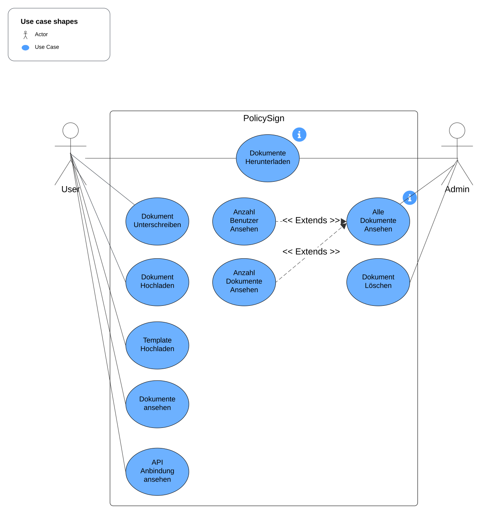
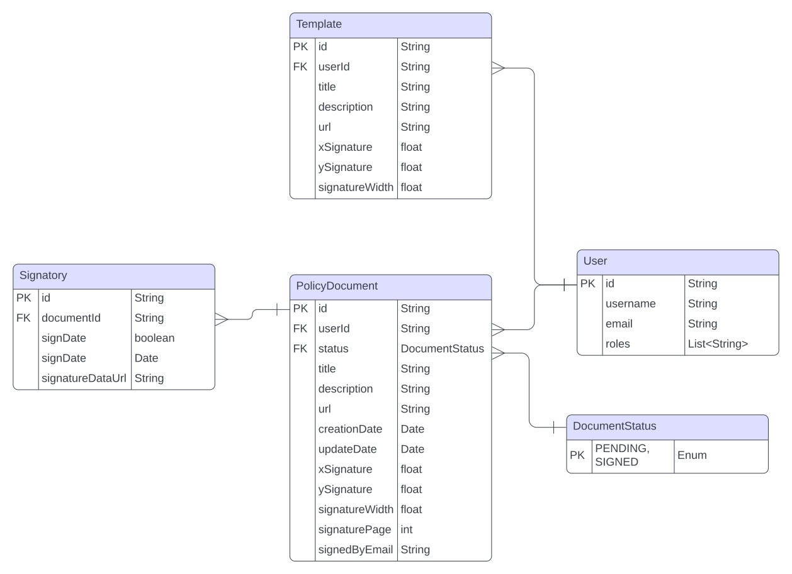
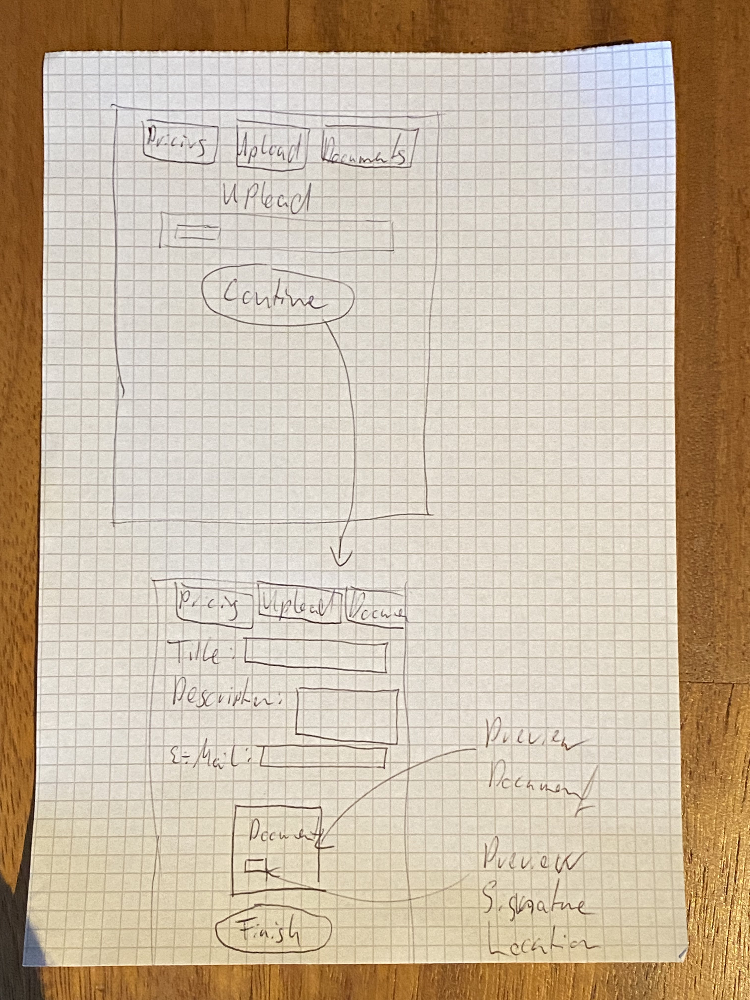
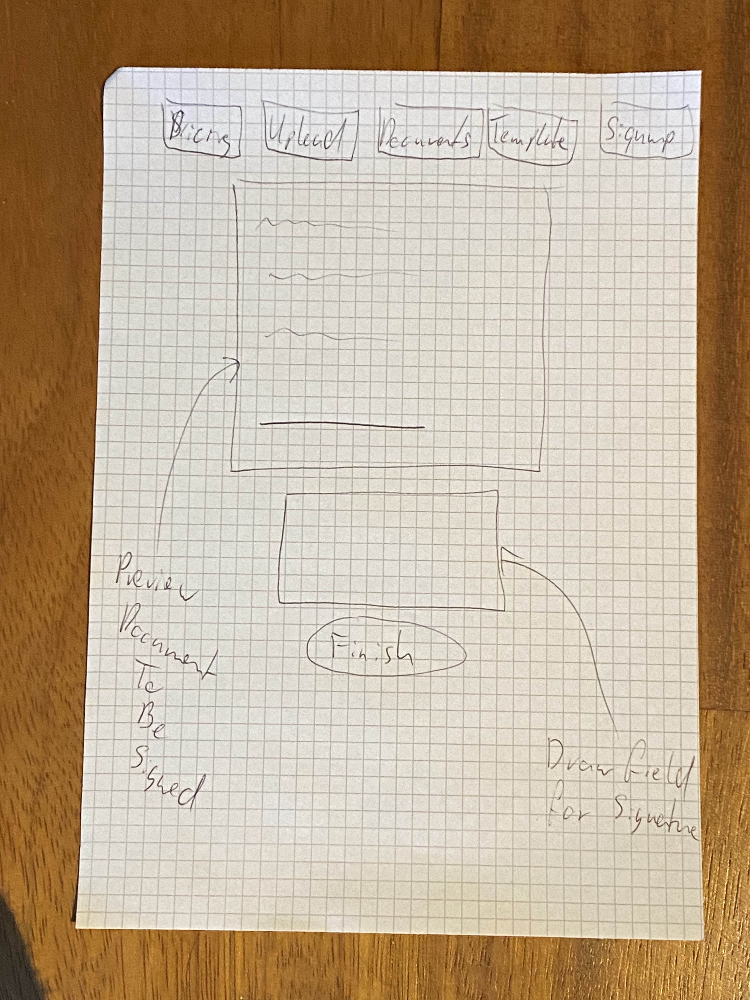
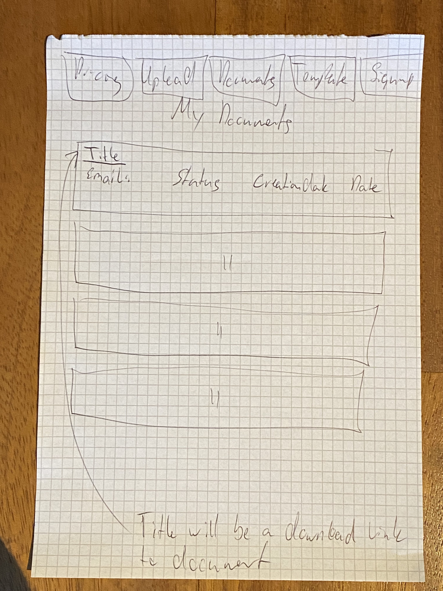
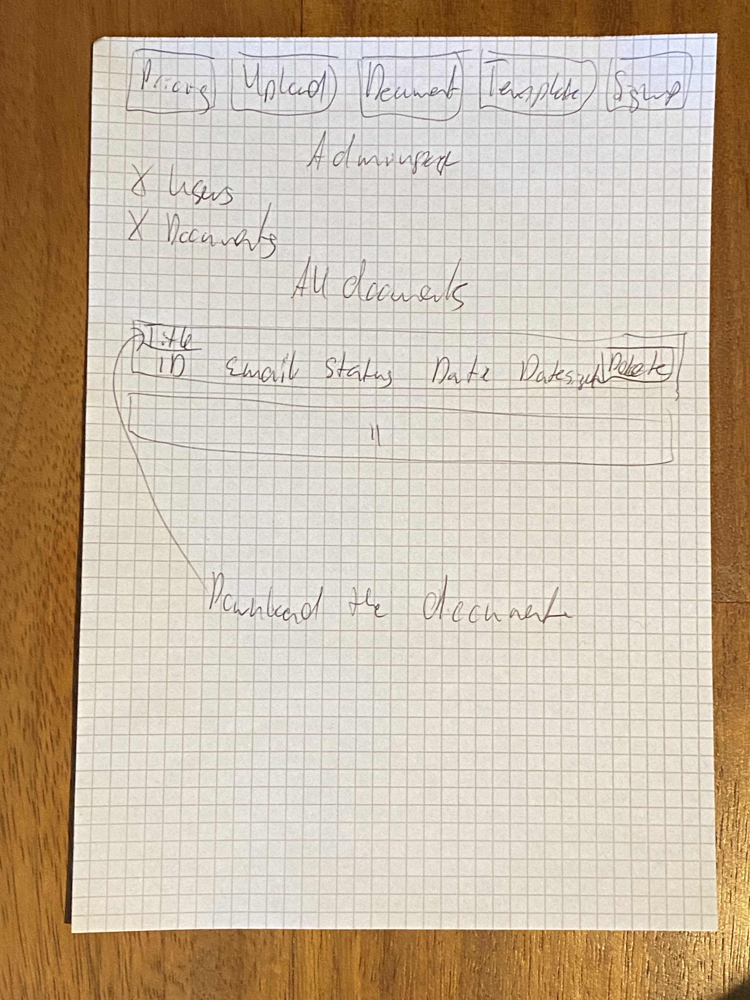
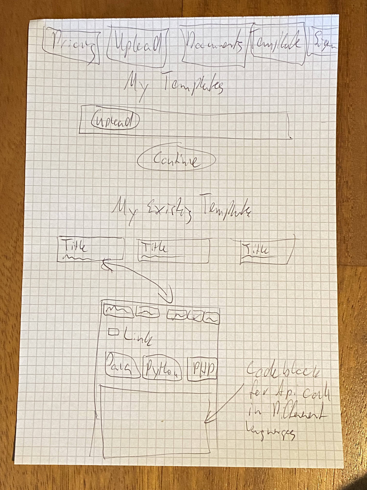

# Dokumentation

## Use-Case Diagramm und Use-Case Beschreibung

### Use-Case Diagramm

### Use-Case Beschreibung

**Use-Case 1: Dokument unterschreiben**

- **Akteure:** Benutzer
- **Vorbedingungen:** Der Benutzer hat einen gültigen Link für den Vertrag erhalten entweder durch eine Webseite oder via seiner E-Mail
- **Beschreibung:**
1. Der Benutzer erhält eine E-Mail mit einem einzigartigen Link zur Unterschrift des Dokuments.
2. Der Benutzer klickt auf den Link und öffnet die Signaturseite.
3. Der Benutzer überprüft das Dokument und unterschreibt im Signaturenfeld.
4. Das System speichert die signierte Version des Dokuments und sendet eine Bestätigung an den Benutzer.

- **Nachbedingungen:** Das Dokument ist unterschrieben, gespeichert und eine Kopie wird dem Unterzeichnenden und dem Auftraggeber via E-Mail zugeschickt.

**Use-Case 2: Dokument hochladen**

- **Akteure:** Benutzer
- **Vorbedingungen:** Der Benutzer hat Zugriff auf das System.
- **Beschreibung:**
1. Der Benutzer lädt ein neues Dokument zur Signatur hoch.
2. Der Benutzer gibt die E-Mail des zu signierenden an
3. Der Benutzer setzt ein Titel
4. Der Benutzer setzt eine Description
5. Der Benutzer definiert die Location der Signatur
6. Das System speichert das Template
7. Das System generiert einen einzigartigen Link und sendet ihn an den Empfänger.

- **Nachbedingungen:** Das Dokument ist hochgeladen und der Link ist generiert welche per E-Mail an den zu signierenden zugeschickt wird.

**Use-Case 3: Template hochladen**

- **Akteure:** Benutzer
- **Vorbedingungen:** Der Benutzer hat Zugriff auf das System.
- **Beschreibung:**
1. Der Benutzer lädt ein neues Dokument zur Signatur hoch.
2. Der Benutzer setzt ein Titel
3. Der Benutzer setzt eine Description
4. Der Benutzer definiert die Location der Signatur
5. Das System speichert das Template

- **Nachbedingungen:** Das Dokument ist hochgeladen und ist unter /template wieder aufzufinden.

**Use-Case 4: Template API Anbindung ansehen**

- **Akteure:** Benutzer
- **Vorbedingungen:** Der Benutzer hat Zugriff auf das System. Und hat ein Template erfolgreich hochgeladen. Dieses Template wurde danach angeklickt.
- **Beschreibung:**
1. Der Benutzer wählt zuerst aus, ob er ein Link oder eine Email erhalten will durch den API Call.
2. Der Benutzer wählt die Programmiersprache des API Calls aus
3. Der Benutzer kopiert den API Call durch den Kopierknopf unterhalb des Codefeldes

- **Nachbedingungen:** Der API Call muss im Prozess des Benutzers integriert werden. Der API Call muss eine E-Mail erhalten wer zu unterzeichnen hat.

**Use-Case 5: Dokumente ansehen**

- **Akteure:** Benutzer
- **Vorbedingungen:** Der Benutzer hat Zugriff auf das System. Und hat ein Dokument erfolgreich versendet. 
- **Beschreibung:**
1. Der Benutzer geht auf die /documents Seite und erhaltet eine Übersicht über all seine Dokumente. Welchen Status sie haben, an wen das Dokument versendet wurde, wann das Dokument versendet wurde und wann das Dokument erstellt wurde.

**Use-Case 6: Dokumente Herunterladen**

- **Akteure:** Benutzer
- **Vorbedingungen:** Der Benutzer hat Zugriff auf das System. Und hat ein Dokument erfolgreich versendet. 
- **Beschreibung:**
1. Der Benutzer klickt auf den Titel des Dokumentes.

- **Nachbedingungen:** Das Dokument wird automatisch heruntergeladen und der Benutzer benötigt genügend Speicherplatz auf seinem System.

**Use-Case 7: Alle Dokumente Ansehen**

- **Akteure:** Admin
- **Vorbedingungen:** Der Admin hat Zugriff auf das System.
- **Beschreibung:**
1. Der Admin kann auf die /admin page gehen und erhaltet einblicke in alle Dokumente.

**Use-Case 8: Anzahl Benutzer Ansehen**

- **Akteure:** Admin
- **Vorbedingungen:** Der Admin hat Zugriff auf das System.
- **Beschreibung:**
1. Der Admin kann auf die /admin page gehen und erhaltet einblicke in die Anzahl Benutzer.

**Use-Case 9: Anzahl Dokumente Ansehen**

- **Akteure:** Admin
- **Vorbedingungen:** Der Admin hat Zugriff auf das System.
- **Beschreibung:**
1. Der Admin kann auf die /admin page gehen und erhaltet einblicke in die Anzahl Dokumente.

**Use-Case 10: Dokument Löschen**

- **Akteure:** Admin
- **Vorbedingungen:** Der Admin hat Zugriff auf das System und hat ein Dokument welches gelöscht werden muss gefunden.
- **Beschreibung:**
1. Der Admin kann auf die /admin page gehen und klickt auf den Delete Knopf.

- **Nachbedingungen:** Die Seite wird neu geladen und das Dokument wurde gelöscht.

## Fachliches Datenmodell (ER-Modell) mit Erläuterungen

### ER-Modell

### Erläuterungen
- **PolicyDocument:** Tabelle, die Informationen über hochgeladene und versendete Dokumente speichert, welche unterschriftsbereit sind oder bereits unterschrieben sind. Es werden hier informationen über das Dokument gespeichert wie den Status, Title, Description und wer es unterschrieben hat. Es werden hier auch Informationen über das Dokument abgelegt, wie zum Beispiel wo die Koordinaten der Unterschrieft sind, wie Breit die Unterschrift sein darf, und wo das Dokument in S3 Abgespeichert wird.
- **Signatory:** Tabelle, die Details über die Unterschrift erhält. Es gibt bescheid ob ein Dokument bereits unterschrieben wurde, wann es unterschrieben wurde und welches Dokument unterschrieben wurde. Wichtig, signatureDataUrl wird NICHT hinterlegt aufgrund des Datenschutzes, da einträge mit diesem Wert existieren bleibt das Feld bestehen.
- **User:** Tabelle, die Informationen zu den Usern speichert, wie username email und rollen. Das Rollen System wird nicht durch auth0 gemacht sondern wird durch DB einträge gemacht, das Login bleibt durch auth0 bestehen. Grund für den User als Entität ist, dass weiter auf diesen User ausgebaut werden muss, mit einem Pay As You Go Modell, wo getracked wird, wie oft ein Benutzer den Service verwendet hat. Und er Zahlungsdaten hinterlegen kann.
- **DocumentStatus:** Tabelle, welche eein Enum ist für den Status eines Dokuments nachdem er verschickt wurde. Entweder PENDING oder SIGNED
- **Template:** Tabelle, die Informationen zu den Templates speichert. Es wird auch hier informationen über den Titel, Description und Informationen wo die Unterschrift sich befindet. Dieses Template wird verwendet einen clone eintrag zu machen im PolicyDocument, sobald ein neues Dokument verschickt werden muss.
## Prozessmodell (BPMN-Diagramm) mit Erläuterungen

### BPMN-Diagramm

### Erläuterungen
- **Dokument hochladen:** Zuerst wird das Dokument von einem User hochgeladen und verarbeitet mit weiteren Daten (Ort der Unterschrift, Breite, Titel, Description)
- **Dokument Verarbeiten:** Das Dokument wird anschliessend in S3 auf AWS hochgeladen, die URL und die Daten aus der Form werden Persistiert auf MongoDB. Anschliessend wird ein Email mit den Daten generiert und an den signierer Versendet, anschliessend erhaltet man im Frontend eine Success Nachricht, dass das Dokument hochgeladen und das E-Mail versendet wurde.
- **Signaturprozess:** Der Benutzer erhält eine E-Mail, klickt auf den Link, überprüft das Dokument und unterschreibt es.
- **Speicherung und Bestätigung:** Das System speichert das signierte Dokument und sendet eine E-Mail an den Benutzer der das Dokument signiert hat, sowie an den Uploader des Dokuments. Das Email enthält eine Kopie des unterzeichneten Dokumentes. Nachdem die Signatur, Dokument und Dokumentdaten persistiert sind, wird der Benutzer im Frontend durch ein Alert aufmerksam gemacht, dass das Dokument erfolgreich hochgeladen wurde und Kopien an alle Parteien versandt wurden.

## Mockup oder Skizze des UIs

### Mockup

### Beschreibung
- **Uploadpage:** Möglichkeit neues Dokument hochladen, weitere details an den Forms eingeben zu können und die Koordinaten anhand eines Interaktiven Tools für die Signatur auszuwählen.

### Beschreibung
- **Signpage:** Möglichkeit neues Dokument zu signieren, Das Dokument kann durchgelesen werden und unten steht ein Feld zum signieren

### Beschreibung
- **Documentspage:** Einsehen von allen Dokumenten welche ein User hochgeladen hat, man sieht den Titel, die Description, den Status, wer signieren muss, Creation- und Updatedatum. Durch den Click auf den Titel wird das Dokument runter geladen.

### Beschreibung
- **Adminpage:** Einsehen von allen Dokumenten welche von Usern hochgeladen wurden, man sieht den Titel, die Description, den Status, wer signieren muss, Creation-, Updatedatum und ein Delete Knopf, wo man ein Dokument löschen kann. Durch den Click auf den Titel wird das Dokument runter geladen.

### Beschreibung
- **Templatespage:** Genau gleich wie bei upload kann hier ein Dokument als ein Template hochgeladen werden, es wird aber nicht nach einer Email gefragt. Unterhalb des Uploadknopfs befinden sich alle Templates, wenn man auf ein Template drauf klickt kommt man auf eine neue Page wo man als API call den die Dienstleistung in seinem service einbauen kann. Zuerst muss man definieren was passieren soll. Soll eine Email verschickt werden oder eine Link retourniert werden. Unten kann man die Programmier sprache auswählen, von wo aus man den API Call kopieren kann.