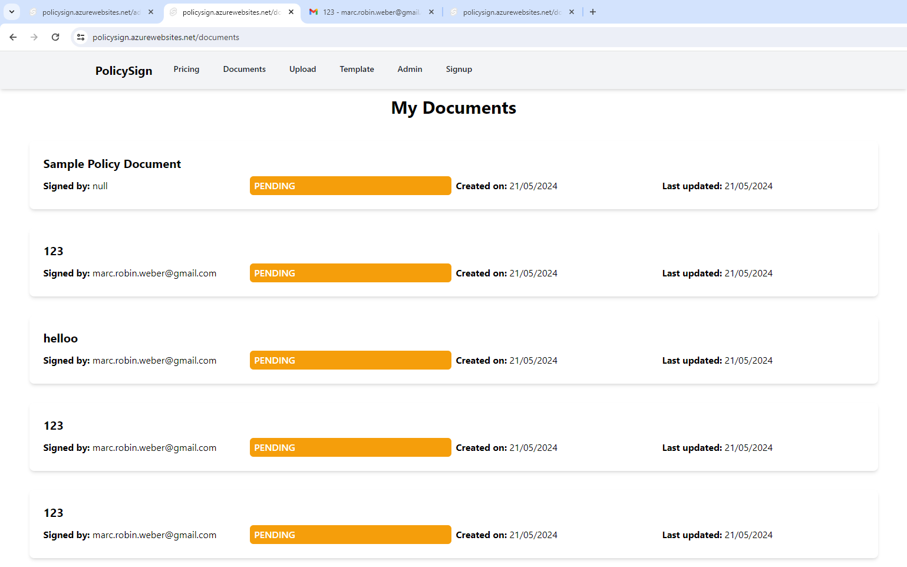
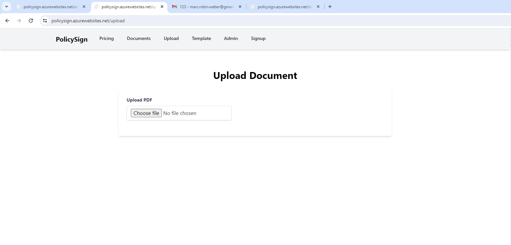
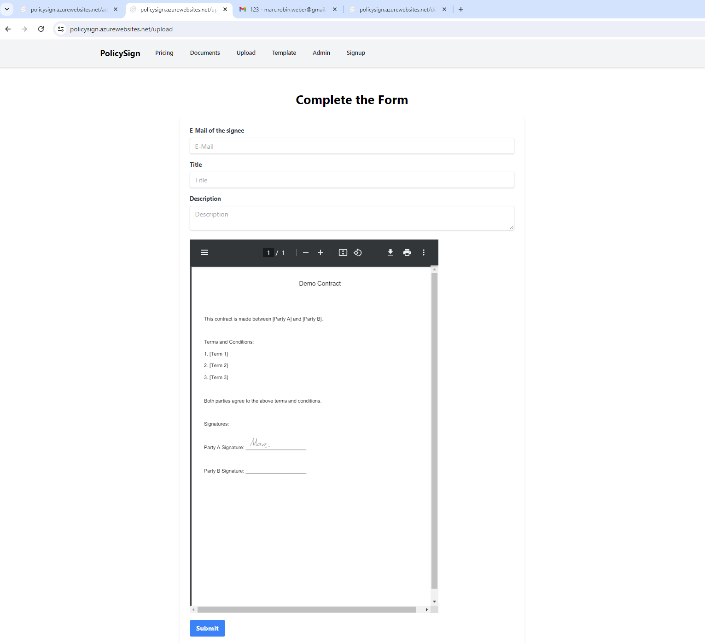
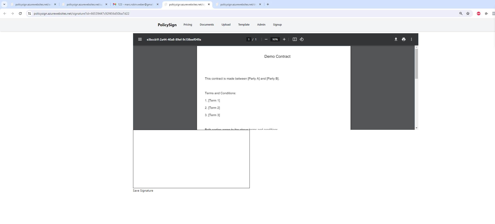
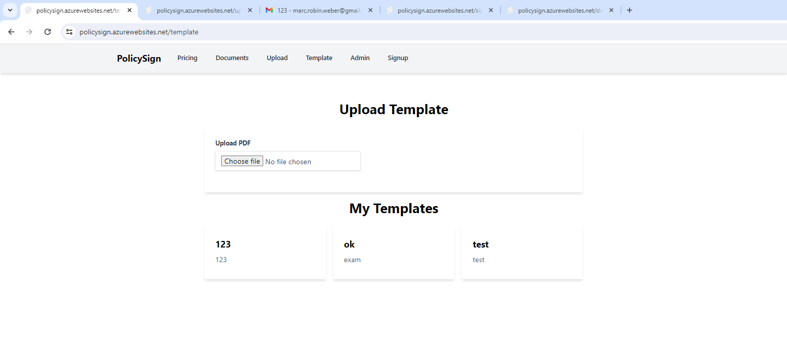
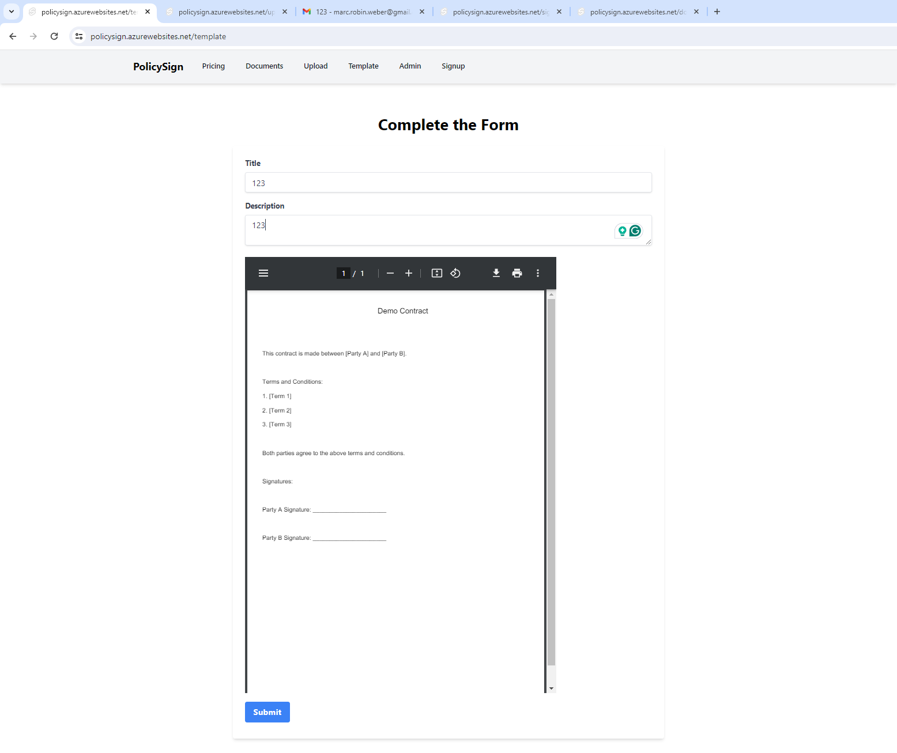
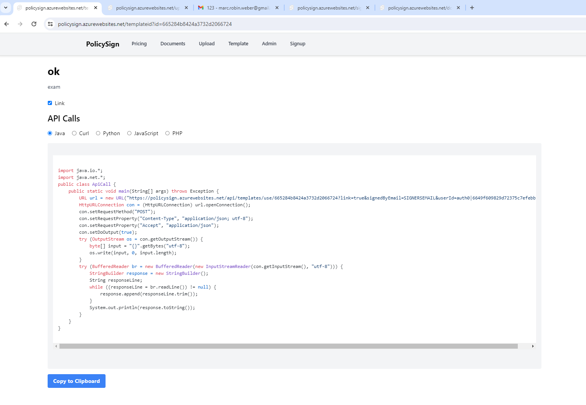
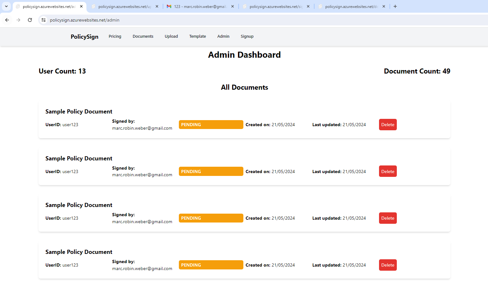
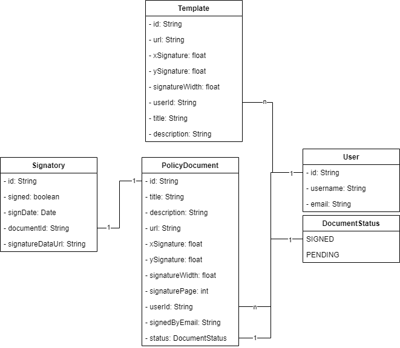
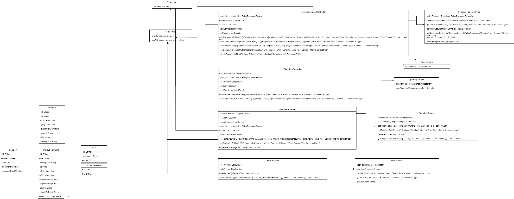

# Implementation

## Beschreibung des Frontends mit Screenshots der fertigen Applikation

Das Frontend unserer Anwendung wurde mit Svelte entwickelt und bietet eine intuitive Benutzeroberfläche, die den Benutzern ermöglicht, Dokumente hochzuladen, zu signieren, Templates zu erstellen und den Status ihrer Dokumente zu überwachen. Die Anwendung ist responsiv und für verschiedene Bildschirmgrößen optimiert. 

### Hauptfunktionen:
1. **Dokumentenübersicht**: Benutzer können eine Liste ihrer hochgeladenen Dokumente einsehen.
2. **Dokument hochladen**: Ermöglicht das Hochladen neuer Dokumente zur Signatur.
3. **Dokument signieren**: Benutzer können Dokumente elektronisch unterschreiben.
4. **Templates erstellen**: Benutzer können Templates für wiederkehrende Dokumente erstellen.
5. **API-Zugang (Pro-Version)**: Erlaubt den Zugriff auf API-Endpunkte für erweiterte Integrationen.
5. **Adming zugang**: Erlaubt den Zugriff die Adminpage, wo Dokumente heruntergeladen, gelöscht und Metriken über die Webseite erfasst sind.

### Screenshots der Applikation:

#### 1. Dokumentenübersicht

#### 2. Dokument hochladen

#### 3. Dokument signieren

#### 4. Templates erstellen

#### 5. API-Zugang (Pro-Version)

#### 5. Adminpage

## Klassendiagramm mit dem technischen Datenmodell (DTOs, DAOs) und deren Verwendungszweck

Das Klassendiagramm stellt die Struktur der Datenobjekte (DTOs) und Datenzugriffsobjekte (DAOs) dar, die in der Anwendung verwendet werden.

### Klassendiagramm

### Beschreibung der Klassen

1. **User**:
   - **Beschreibung**: Repräsentiert einen Benutzer der Anwendung.
   - **Attribute**: `id`, `username`, `email`, `roles`
   - **Verwendungszweck**: Verwaltung der Benutzerinformationen und deren Rollen.

2. **PolicyDocument**:
   - **Beschreibung**: Repräsentiert ein zu signierendes Dokument.
   - **Attribute**: `id`, `title`, `description`, `url`, `status`, `creationDate`, `updateDate`, `xSignature`, `ySignature`, `signatureWidth`, `signaturePage`, `userId`, `signedByEmail`
   - **Verwendungszweck**: Speicherung und Verwaltung der Dokumentinformationen. Hier werden auch Informationen über den Ort der Signatur hinterlegt oder wo bei S3 die Datei abgelegt ist.

3. **Template**:
   - **Beschreibung**: Repräsentiert ein Dokumenttemplate.
   - **Attribute**: `id`, `url`, `xSignature`, `ySignature`, `signatureWidth`, `userId`, `title`, `description`
   - **Verwendungszweck**: Verwaltung der Templates für wiederkehrende Dokumente. Schlussendlich wird für ein Template der ganze "Datensatz" in ein neues PolicyDocument kopiert, wenn ein neues PolicyDocument anhand eines Templates erstellt wurde.

4. **Signatory**:
   - **Beschreibung**: Repräsentiert einen Unterzeichner eines Dokuments.
   - **Attribute**: `id`, `signed`, `signDate`, `documentId`, `signatureDataUrl`
   - **Verwendungszweck**: Speicherung der Unterschrifteninformationen. Speziell, ob ein Dokument bereits unterschreieben wurde oder nicht. Es wird nicht mehr signatureDataUrl also ein Base64 String des Dokuments abgespeichert, da dies Datenschutzmässig problematisch ist. Bei früheren Versionen wurde dies so implementiert und die bestehende Testsätze bleiben bestehen.

### Klassendiagramm

Das Klassendiagramm unseres Projekts zeigt eine Übersicht der wichtigsten Klassen und deren Beziehungen zueinander. Es umfasst die Controller- und Serviceklassen, die Modellklassen, die Repository-Interfaces sowie einige Konfigurations- und Hilfsklassen. Im Folgenden wird eine detaillierte Beschreibung der verschiedenen Ebenen und ihrer jeweiligen Klassen gegeben.

#### Controller-Schicht

**UserController**
- Dieser Controller verwaltet alle HTTP-Anfragen, die mit Benutzeroperationen zusammenhängen. Dazu gehören das Erstellen neuer Benutzer, das Abrufen der Benutzeranzahl und andere benutzerbezogene Endpunkte. Er delegiert die Geschäftslogik an den `UserService` und überprüft Benutzerrollen mithilfe des `RoleService`.

**PolicyDocumentController**
- Dieser Controller ist für das Hochladen, Herunterladen und Verwalten von Dokumenten verantwortlich. Er ermöglicht es Benutzern, neue Dokumente hochzuladen, Dokumente anhand der Benutzer-ID abzurufen und den Status von Dokumenten zu überprüfen. Die Geschäftslogik wird an den `PolicyDocumentService`, `EmailService`, `S3Service` und `RoleService` delegiert.

**SignatoryController**
- Dieser Controller behandelt die Signaturprozesse für Dokumente. Er ermöglicht das Abrufen von Dokumenten zum Signieren und das Speichern von Signaturen. Er verwendet den `SignatoryService`, `PolicyDocumentService`, `UserService`, `S3Client` und `JavaMailSender`.

**TemplateController**
- Der TemplateController verwaltet Vorlagen für Dokumente. Er ermöglicht das Erstellen, Abrufen und Verwenden von Vorlagen sowie das Löschen von Vorlagen. Er delegiert die Geschäftslogik an den `TemplateService`, `S3Client`, `EmailService`, `PolicyDocumentService`, `S3Service` und `RoleService`.

#### Service-Schicht

**UserService**
- Dieser Service ist für die Verwaltung der Benutzerinformationen verantwortlich. Er stellt Methoden zum Speichern, Abrufen und Zählen von Benutzern bereit und kommuniziert dabei direkt mit dem `UserRepository`.

**PolicyDocumentService**
- Dieser Service verwaltet die Geschäftslogik für die Dokumente. Dazu gehören das Speichern, Abrufen und Löschen von Dokumenten sowie das Zählen der vorhandenen Dokumente. Er kommuniziert mit dem `PolicyDocumentRepository`.

**SignatoryService**
- Dieser Service verwaltet die Signaturinformationen der Benutzer. Er stellt Methoden zum Speichern und Abrufen von Signaturinformationen bereit und verwendet das `SignatoryRepository`.

**TemplateService**
- Dieser Service verwaltet die Vorlagen für Dokumente. Er ermöglicht das Speichern, Abrufen und Löschen von Vorlagen sowie das Abrufen von Vorlagen nach Benutzer-ID. Er kommuniziert mit dem `TemplateRepository`.

**EmailService**
- Dieser Service ist für das Senden von E-Mails zuständig. Er nutzt den `JavaMailSender`, um HTML-E-Mails an Benutzer zu senden, wenn ein neues Dokument zur Signatur bereitsteht oder ein Dokument erfolgreich signiert wurde.

**RoleService**
- Der RoleService überprüft die Rollen eines Benutzers anhand des JWT-Tokens. Er stellt sicher, dass nur berechtigte Benutzer auf bestimmte Endpunkte zugreifen können, indem er die Benutzerinformationen vom `UserService` abruft.

**S3Service**
- Dieser Service verwaltet die Interaktionen mit Amazon S3. Er ermöglicht das Hochladen und Herunterladen von Dateien zu und von S3-Buckets.

## Aufgaben und Funktionen eingebundener Drittsysteme

### Eingebundene Drittsysteme:

1. **Auth0**:
   - **Beschreibung**: Authentifizierungs- und Autorisierungsdienst.
   - **Funktion**: Verwaltung der Benutzeranmeldung und -authentifizierung sowie der Zugriffskontrollen.

2. **AWS S3**:
   - **Beschreibung**: Cloud-Speicherdienst von Amazon Web Services.
   - **Funktion**: Speicherung und Abruf der hochgeladenen Dokumente und Templates.

3. **JavaMailSender**:
   - **Beschreibung**: Bibliothek zum Senden von E-Mails in Java-Anwendungen.
   - **Funktion**: Versand von Benachrichtigungen und Dokumenten an die Benutzer per E-Mail.

4. **PDFBox**:
   - **Beschreibung**: Open-Source-Bibliothek zum Erstellen und Bearbeiten von PDF-Dokumenten.
   - **Funktion**: Hinzufügen von Signaturen zu PDF-Dokumenten.

### Funktionen der Drittsysteme:

- **Auth0**: 
  - Benutzerregistrierung und -anmeldung
  - JWT-Token-Generierung und -Validierung
  - Rollenbasierte Zugriffskontrolle

- **AWS S3**: 
  - Sicheres Hochladen von Dokumenten
  - Abrufen und Herunterladen von gespeicherten Dokumenten
  - Verwaltung von Dokumenten-URLs

- **JavaMailSender**: 
  - Erstellen und Versenden von E-Mail-Benachrichtigungen
  - Anhängen von signierten Dokumenten an E-Mails

- **PDFBox**: 
  - Hinzufügen von grafischen Signaturen zu PDF-Dokumenten
  - Speichern und Aktualisieren von PDF-Dateien
